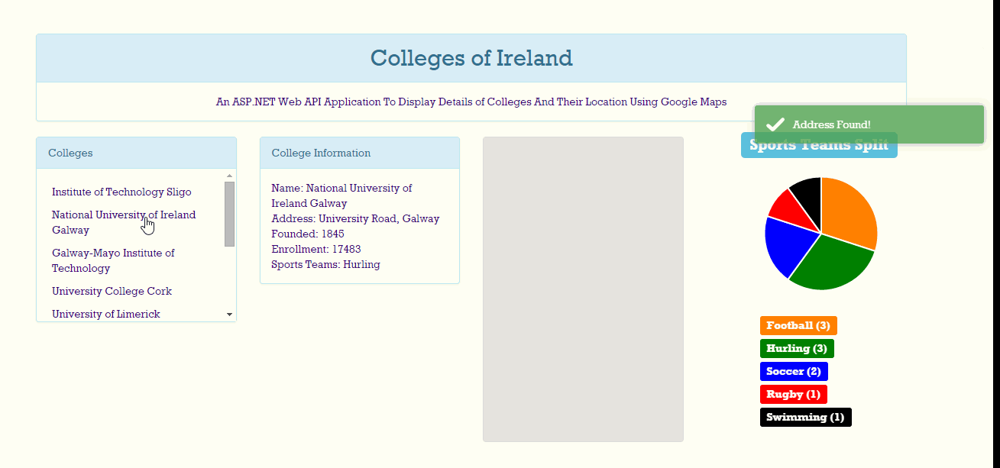

####RAD302 CA1 - S00127670

An ASP.NET Web API Application To Display Details of Colleges And Their Location Using Google Maps

Final Commit:
* Populate Table With Code First Database Approach
* Display Info About Colleges When College Name Is Clicked On
* Update Google Map With Colleges Location
* Display Sports Teams For Each College On Pie Chart
* Toastr Messages Used To Provide User Feedback
* Bootstrap Used For Styling

Problems:
* Adding Address Above Marker On Map Using InfoWindow
